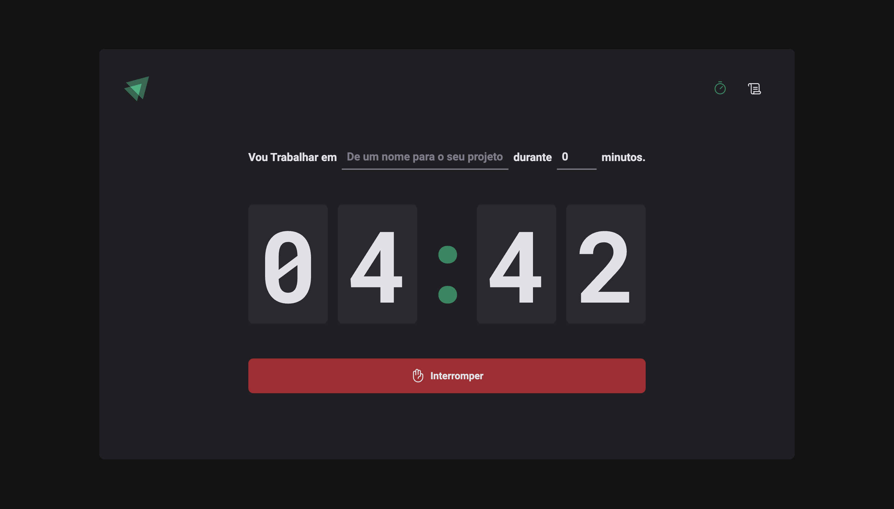
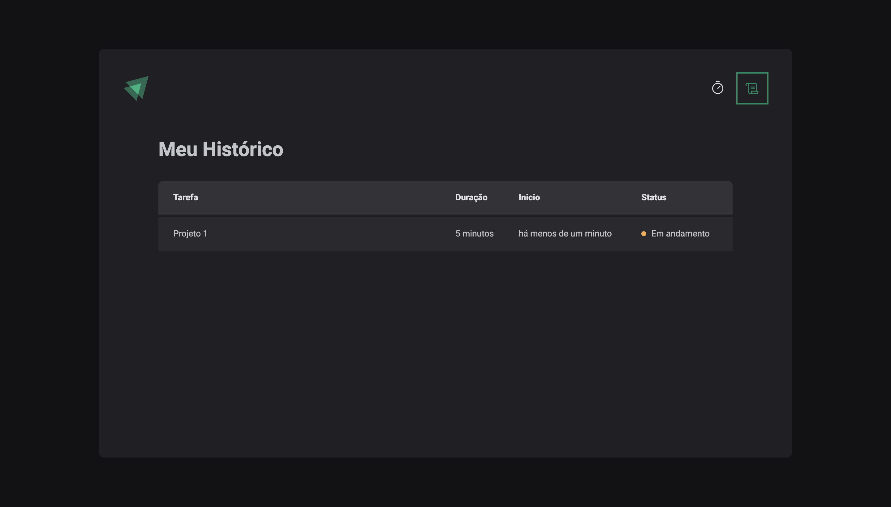

# 📸 Overview:




# 🚀 Technologies:
### ✔️ ReactJS 
### ✔️ TypeScript
### ✔️ React-Hook-Form
### ✔️ Styled-Components
### ✔️ Vite
### ✔️ Zod

# How to run

```
# Clone this repository
$ git clone https://github.com/vinnycosta9898/ignite-timer

# Go to the directory
$ cd ignite-timer

# Install Dependencies
$ npm install

# Run Web Server
$ npm run dev